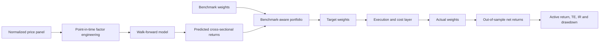
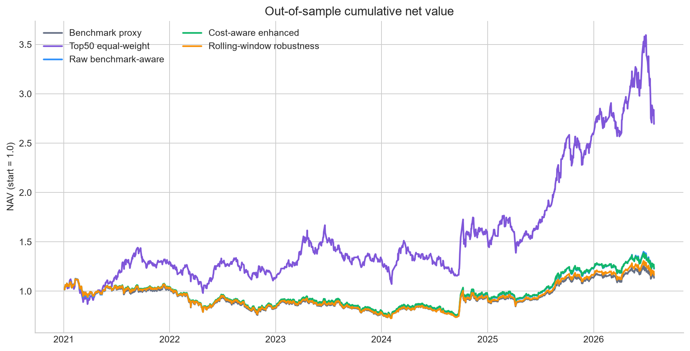

# CSI 300 Index Enhancement Lab

[](https://github.com/Opportunity4u/csi300-index-enhancement-lab/actions/workflows/ci.yml)
[](LICENSE)
[](https://www.python.org/)

A research-grade, benchmark-aware workflow that turns cross-sectional return
forecasts into a long-only CSI 300 enhancement portfolio, then evaluates the
portfolio with delayed execution, drifted holdings, turnover limits, no-trade
bands and transaction costs.

The project is designed to answer a practical question:

> How much model alpha survives portfolio constraints and implementation costs?

## What makes this more than a prediction demo

- Walk-forward ridge forecasts; labels must mature before a row can enter training.
- Cross-sectional factor diagnostics: Rank IC, ICIR, quantile returns and decay.
- Benchmark weight plus active weight, instead of unconstrained Top-K selection.
- Explicit target weights versus drifted, actually executed weights.
- Next-trading-day execution, turnover caps, no-trade bands and asymmetric costs.
- Expanding-window main test and rolling-window robustness check.
- Reproducible synthetic-data demo requiring no proprietary market data.
- Broker-agnostic shadow-order packets with A-share board-lot rounding.

## Architecture



## Quick start

```bash
python -m venv .venv
python -m pip install -e ".[dev]"
csi300-research demo --root demo_run
```

The demo creates a deterministic synthetic equity panel, runs the complete
pipeline, and writes charts and tables to `demo_run/results/`. It does not
download or redistribute market data.

To run on your own normalized files:

```bash
csi300-research run --root .
```

Expected files are documented in [docs/data-contract.md](docs/data-contract.md).

## Illustrative empirical snapshot

The repository includes aggregate outputs from one historical research run:

| Strategy | Annualized return | Annualized active return | Tracking error | Information ratio |
|---|---:|---:|---:|---:|
| Benchmark proxy | 2.39% | 0.00% | 0.00% | N/A |
| Cost-aware enhanced | 3.95% | 1.55% | 1.97% | 0.87 |
| Rolling-window robustness | 2.88% | 0.49% | 1.42% | 0.41 |



These numbers are **not an investable track record**. The run uses a fixed
current-constituent approximation and therefore contains survivorship and
future-universe bias. Prices are not redistributed. See
[DATA_NOTICE.md](DATA_NOTICE.md) and [docs/methodology.md](docs/methodology.md).

## Repository map

```text
src/csi300_enhancement/
  data.py              normalized data contract and validation
  factors.py           point-in-time factor engineering
  factor_analysis.py   Rank IC, decay and quantile tests
  model.py             leakage-controlled walk-forward forecasts
  portfolio.py         benchmark-relative target construction
  backtest.py          drift, execution, turnover and cost simulation
  metrics.py           absolute and active performance metrics
  reporting.py         public charts and report generation
  shadow.py            reviewable paper-account order packets
tests/                  invariants and timing tests
results/illustrative/   aggregate, bias-disclosed example outputs
```

## Research limits

- Public code cannot cure non-point-in-time inputs.
- The included empirical snapshot uses fixed current constituents and a
  fixed-share benchmark proxy.
- Close-only input uses fixed all-in basis-point costs; an impact model requires
  reliable historical traded amount.
- No order-book fill uncertainty, limit-up/limit-down mechanics, corporate
  actions or tax-lot accounting are simulated.

Use genuine dated membership, total-return prices, benchmark weights and
liquidity data before making investment claims.

For a forward shadow-account workflow, see
[docs/paper-trading.md](docs/paper-trading.md).

## License and disclaimer

Code is available under the [MIT License](LICENSE). This repository is for
research and education only and is not investment advice. See
[DISCLAIMER.md](DISCLAIMER.md).
